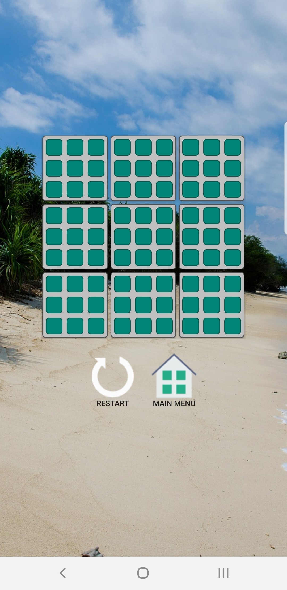
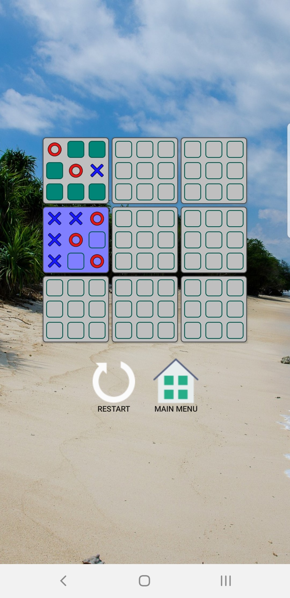
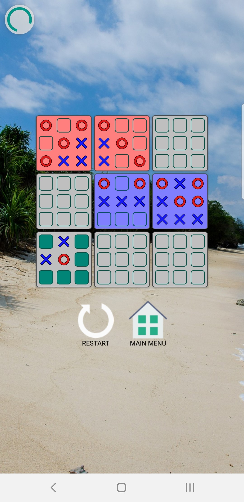

# Ultimate-Tic-Tac-Toe-Kotlin-
This game is played just like regular Tic Tac Toe with one difference: to win a tile, you have to win a smaller game of Tic Tac Toe inside that tile.
A tie happens when there are no further moves. In the case of a tie in a small board, that will count as a win for both sides in the larger game.

